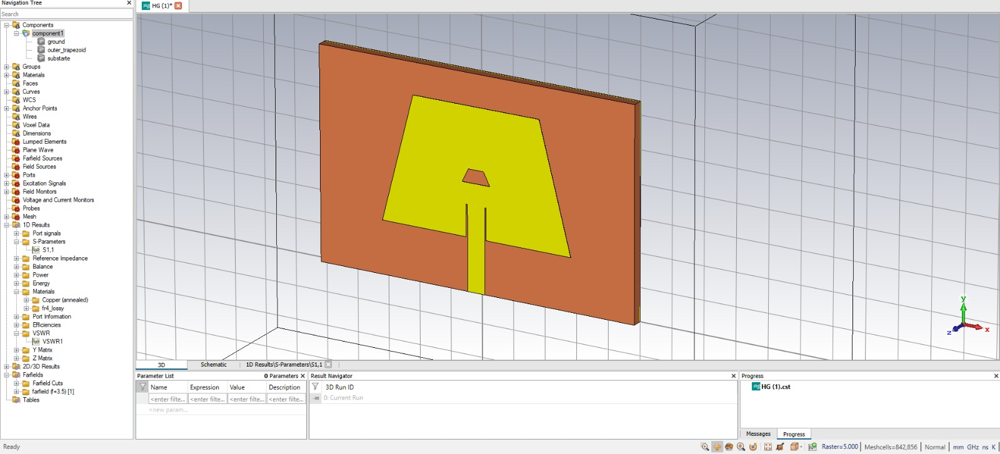
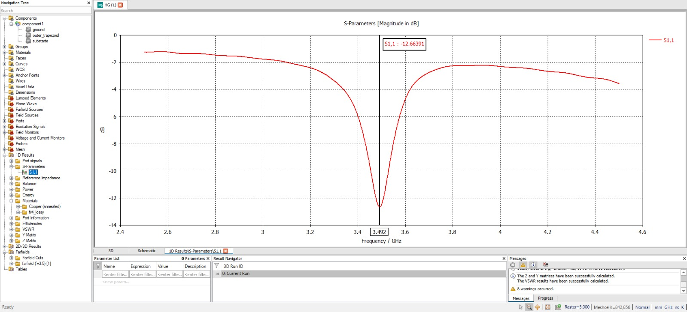
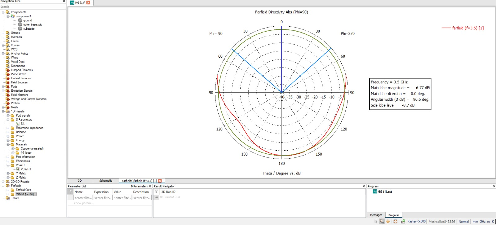
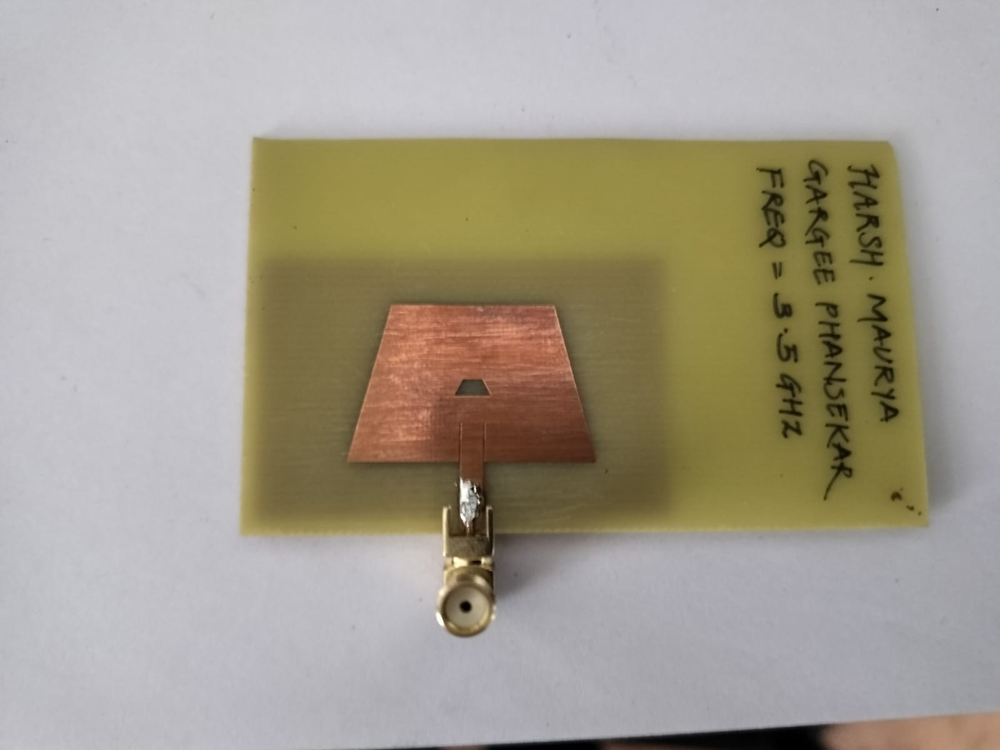

# Trapezoidal Microstrip Patch Antenna (3.5 GHz)

## Overview
This project presents the design and simulation of a trapezoidal ring microstrip patch antenna for 5G lower band applications (3.4–3.6 GHz).

The antenna is designed using CST Studio Suite and operates at a resonant frequency of 3.492 GHz.

---

## Specifications
- Frequency: 3.5 GHz
- Substrate: FR4
- Dielectric Constant: 4.3
- Thickness: 1.6 mm
- Feed Type: Microstrip line (50 Ω)

---

## Results
- Return Loss (S11): -12.664 dB
- VSWR: 1.607
- Directivity: 6.77 dBi

---

## Files Included
- CST Design File (.cst)
- Project Report (.pdf)

---

## Applications
- 5G Communication (Sub-6 GHz)
- IoT Devices
- Wireless Communication Systems

## Antenna Design

## S11 Plot

## Radiation Pattern

## Fabricated Antenna

## Author
Harsh Maurya
